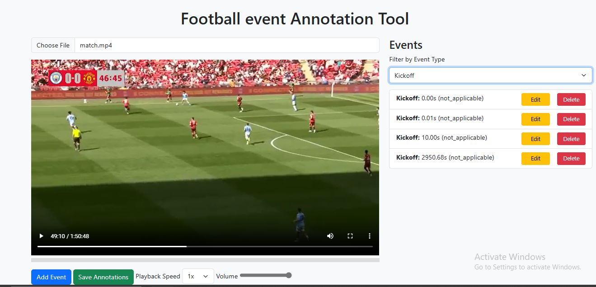

# Football Video Annotation Tool

This repository contains a web-based tool for annotating football (soccer) videos. The tool allows users to upload videos, add annotations for specific events (e.g., goals, fouls, penalties), and save these annotations for later use. The annotations are displayed as markers on the video seek bar, similar to YouTube's chapter markers.

This application is intended to be used with SoccerNet annotations to ease the process of event annotations. For more information, visit [SoccerNet](https://github.com/SoccerNet).


## Demo
[here](recording.webm).


## Features

- **Video Upload**: Upload football videos in common formats (e.g., MP4, AVI).
- **Annotation Management**:
  - Add annotations for specific events (e.g., goals, fouls, penalties).
  - Edit or delete existing annotations.
  - Filter annotations by event type.
- **Seek Bar Markers**: Annotations are displayed as markers on the video seek bar for easy navigation.
- **Save and Load Annotations**: Save annotations to a JSON file and load them when reopening the video.

## Technologies Used

- **Frontend**:
  - HTML, CSS, JavaScript
  - [Bootstrap](https://getbootstrap.com/) for styling
  - [jQuery](https://jquery.com/) for DOM manipulation and AJAX requests
- **Backend**:
  - [Flask](https://flask.palletsprojects.com/) (Python) for handling file uploads and serving annotations
- **Video Processing**:
  - [OpenCV](https://opencv.org/) for extracting video metadata (e.g., duration)

## Installation

### Prerequisites

- Python 3.x

### Steps

1. **Clone the Repository**:
   ```bash
   git clone https://github.com/your-username/football-video-annotation-tool.git
   cd football-video-annotation-tool
   ```

2. **Install Dependencies**:
   - Install Python dependencies from the `requirements.txt` file:
     ```bash
     pip install -r requirements.txt
     ```

3. **Prepare Your Files**:
   - Ensure your video file is placed in the `uploads` folder.
   - Make sure the corresponding annotation file is in the `annotations` folder with the same name as your video.
   - For reference, see the `annotations_output.json` format.

### Running the Application

- To start the application, run the `app.py` file:
  ```bash
  python app.py
  ```

### Usage

- **Upload a Video**:
  - Click the "Choose File" button to upload a video.
  - Once uploaded, the video will be displayed in the player.

- **Add Annotations**:
  - Use the "Add Event" button to open the annotation modal.
  - Fill in the event details (e.g., time, label, team, visibility) and save the annotation.

- **View Annotations**:
  - Annotations are displayed as markers on the video seek bar.
  - Hover over a marker to see the event label.
  - Click a marker to seek to the corresponding time in the video.

- **Save Annotations**:
  - Click the "Save Annotations" button to save the annotations to a JSON file.

- **Load Annotations**:
  - When reopening a video, annotations will be loaded automatically if a corresponding JSON file exists.

## Demo

Here is a demo of the Football Video Annotation Tool:

### Video Demo

### Website Image

